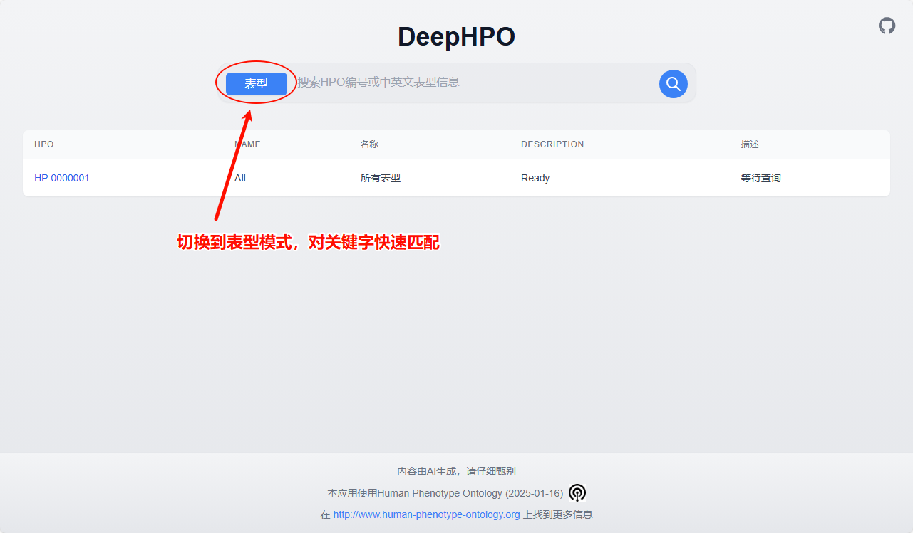

# DeepHPO 

## 项目简介
DeepHPO是一个基于DeepSeek的临床表型HPO术语提取的Web应用，旨在为用户提供便捷的HPO术语查询服务。

通过[Vercel在线使用](https://deephpo.vercel.app/)！ 

**Vercel的超时机制（60秒），可能会无法获取到完整信息导致查询失败。**

**默认使用硅基流动的API，但是您也可以通过主页的设置按钮设置其他使用OPENAI格式的服务提供商。**

**HPO术语使用DeepSeek-V3翻译，请仔细甄别**

1. 用户可以通过输入患者的临床诊断信息，系统会使用DeepSeek-V3对信息进行提取，输出其中可能存在的HPO术语

2. 用户可以通过以下方式查询表型信息：
- HPO编号
- 表型英文名称
- 表型英文描述
- 表型中文名称（由deepseek-V3生成，请仔细甄别）
- 表型中文描述（由deepseek-V3生成，请仔细甄别）

## 主要功能
1. 搜索引擎式主页界面
2. 支持多种查询方式
3. 快速响应的表型信息展示
4. 基于Deepseek-V3的患者临床信息HPO编号提取

## 切换功能




## 技术栈
- Next.js

## 快速开始

克隆项目

```bash
git clone https://github.com/pzweuj/DeepHPO.git
```

建议根据服务提供商自行调整下面脚本，以及将route.ts的引用组件切换回deepseek.tsx

```
src/app/components/deepseek.tsx
src/app/api/query/route.ts
```

如果你也使用[硅基流动](https://cloud.siliconflow.cn/i/mHQgxhJC)的API，则可以在.env.local.self中填入自己的key，并将文件名修改为.env.local

接下来自行部署这个应用

```bash
npm install
npm run dev
```

## 引用与许可

应用数据库来源于[HPO obo文件](http://purl.obolibrary.org/obo/hp.obo)（版本 2025-01-16）。

了解更多请访问：[http://www.human-phenotype-ontology.org](http://www.human-phenotype-ontology.org)

Cite: [doi: 10.1093/nar/gkad1005](https://pmc.ncbi.nlm.nih.gov/articles/PMC10767975/)

